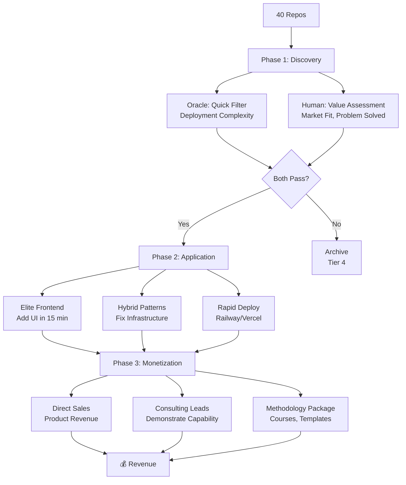

# Visual Workflow Diagrams

**Created**: Nov 23, 2025
**Purpose**: Quick visual reference for key workflows and systems

---

## 1. Strategy Flow: Revenue Through Methodologies



**Key**: Oracle filters (speed), Human validates (value), Methodologies polish (execution)

---

## 2. Oracle + Human Collaboration

```
┌─────────────────────────────────────────────────┐
│              Repo Assessment Flow                │
└─────────────────────────────────────────────────┘

    📁 Repository
         │
         ▼
    ┌────────────────┐
    │  Oracle Scan   │  (2.3 seconds)
    │  - Dockerfile? │
    │  - Tests?      │  → Score: 0-100
    │  - README?     │  → Grade: A-F
    │  - Git remote? │  → Platform: Railway/Vercel
    └────────────────┘
         │
         ▼
    [ Score >= 80? ]───No──→ Archive or Fix
         │                    (Tier 4)
        Yes
         │
         ▼
    ┌────────────────┐
    │ Human Verify   │  (5 minutes)
    │  - What is it? │
    │  - Who needs?  │  → Value: High/Medium/Low
    │  - Monetize?   │  → Revenue path?
    └────────────────┘
         │
         ▼
    [ Value: High? ]───No──→ Keep Deployed
         │                    (Tier 3: Portfolio)
        Yes
         │
         ▼
    ┌────────────────┐
    │ Apply Methods  │  (10-20 minutes)
    │  - Add UI      │
    │  - Fix bugs    │  → Polished Product
    │  - Deploy      │
    └────────────────┘
         │
         ▼
    💰 Revenue Target
    (Tier 1: Commercial)
```

**Collaboration**: Oracle (fast filter) → Human (value judge) → Methodologies (execute)

---

## 3. Deployment Decision Tree

```
Repository Ready to Deploy?
│
├─ Has Dockerfile + requirements.txt?
│  └─ YES → ┌─────────────────────┐
│            │   RAILWAY           │
│            │ ✅ Backend APIs      │
│            │ ✅ ML models         │
│            │ ✅ Python/FastAPI    │
│            └─────────────────────┘
│            Steps:
│            1. Add PORT from env
│            2. Create railway.json
│            3. Add /health endpoint
│            4. git push origin main
│            5. railway logs (monitor)
│
├─ Has package.json + React/Next?
│  └─ YES → ┌─────────────────────┐
│            │   VERCEL            │
│            │ ✅ Next.js apps      │
│            │ ✅ React frontends   │
│            │ ✅ Static sites      │
│            └─────────────────────┘
│            Steps:
│            1. vercel --prod --yes
│            2. ⚠️  Disable auth!
│            3. Verify HTTP 200
│            4. Connect GitHub (CI/CD)
│
└─ Just HTML/CSS/Markdown?
   └─ YES → ┌─────────────────────┐
             │   NETLIFY           │
             │ ✅ Static sites      │
             │ ✅ Documentation     │
             │ ✅ Portfolios        │
             └─────────────────────┘
             Steps:
             1. netlify deploy --prod
             2. OR: git push (if connected)

⚠️  CRITICAL: Vercel defaults to auth-protected
    → Go to dashboard → Deployment Protection → Disable
```

---

## 4. Context File Architecture

```
Session Start
     │
     ▼
┌──────────────────────────────────────┐
│   AUTO-LOADED (Always Present)       │
├──────────────────────────────────────┤
│ ~/.claude/CLAUDE.md                  │
│  - Global rules                      │
│  - Tools available                   │
│  - Latest governance (at end)        │
│                                      │
│ ./CLAUDE.md (if in project)          │
│  - Project-specific rules            │
│  - Tech stack notes                  │
└──────────────────────────────────────┘
     │
     │ (Optional: @ import when needed)
     ▼
┌──────────────────────────────────────┐
│   STRATEGIC CONTEXT (@import)        │
├──────────────────────────────────────┤
│ @strategy.md                         │
│  - Revenue goals                     │
│  - Oracle + Human pattern            │
│  - Decision framework                │
│                                      │
│ @philosophy.md                       │
│  - 8 core values                     │
│  - AI-native developer thesis        │
│                                      │
│ @PORTFOLIO_VALUE_MAP.md              │
│  - 6 deployed products               │
│  - 8 archive candidates              │
│  - Value tiers                       │
└──────────────────────────────────────┘
     │
     ▼
┌──────────────────────────────────────┐
│   TEMPORAL STATE (Read manually)     │
├──────────────────────────────────────┤
│ SESSION_HANDOFF.md                   │
│  - What just happened                │
│  - Next actions                      │
│  - Current portfolio status          │
│                                      │
│ current-status.md                    │
│  - Today's date                      │
│  - Active priorities                 │
└──────────────────────────────────────┘

KEY:
━━━ Auto-loads (always)
─ ─ Import when needed (@)
··· Read manually (temporal)
```

---

## 5. Elite Frontend Code Generation Workflow

```
User Request
    │
    ▼
┌─────────────────────────────┐
│  ollama run elite-frontend  │
│  "Create [component]"       │  (3 minutes)
└─────────────────────────────┘
    │
    ▼
┌─────────────────────────────┐
│  AI Generates B+ Code       │
│  ✅ 85% Correct:            │
│     - TypeScript types      │
│     - Shadcn components     │
│     - Responsive design     │
│     - Accessibility         │
│                             │
│  ⚠️  15% Needs Fixes:       │
│     - Icon imports          │
│     - API field names       │
│     - Edge cases            │
└─────────────────────────────┘
    │
    ▼
┌─────────────────────────────┐
│  Human QA (2 minutes)       │
│  1. Fix: Icon → Check,      │
│     Mail, Shield, etc.      │
│  2. Verify: API payload     │
│     matches backend         │
│  3. Check: TypeScript       │
│     compiles                │
└─────────────────────────────┘
    │
    ▼
┌─────────────────────────────┐
│  Copy to Next.js Project    │
│  - app/page.tsx             │
│  - app/components/*.tsx     │
└─────────────────────────────┘
    │
    ▼
┌─────────────────────────────┐
│  Deploy to Vercel           │
│  - vercel --prod --yes      │
│  - Disable auth             │
│  - Verify HTTP 200          │
└─────────────────────────────┘
    │
    ▼
Production UI Live ✅
(Total: ~15 min vs 45 min from scratch)
```

---

## 6. Repository Value Tiers (Visual)

```
╔═══════════════════════════════════════════════════════════╗
║              PORTFOLIO VALUE TIERS                        ║
╠═══════════════════════════════════════════════════════════╣
║                                                           ║
║  TIER 1: Commercial Products (Revenue/Consulting)         ║
║  ┌─────────────────────────────────────────────────────┐ ║
║  │ 🎯 PhishGuard (Full-Stack)                          │ ║
║  │    Railway API + Vercel UI                          │ ║
║  │    → Add pricing (freemium model)                   │ ║
║  │                                                     │ ║
║  │ 🎯 jaspermatters-job-intelligence                   │ ║
║  │    ML portfolio showcase                            │ ║
║  │    → Consulting lead generator                      │ ║
║  │                                                     │ ║
║  │ 🎯 FretForge                                        │ ║
║  │    Guitar learning + accessibility                  │ ║
║  │    → Freemium app OR consulting                     │ ║
║  └─────────────────────────────────────────────────────┘ ║
║                                                           ║
║  TIER 2: Ready to Deploy (High Value)                     ║
║  ┌─────────────────────────────────────────────────────┐ ║
║  │ ⚡ llm-engineer-demo                                │ ║
║  │    FastAPI + multi-agent + RAG                      │ ║
║  │    → Enterprise consulting demo                     │ ║
║  └─────────────────────────────────────────────────────┘ ║
║                                                           ║
║  TIER 3: Personal Use (Not Commercial)                    ║
║  ┌─────────────────────────────────────────────────────┐ ║
║  │ 🏠 OurJourney/personal-journey-flow                 │ ║
║  │    Couples wellness, custody tracking               │ ║
║  │    → Keep for personal use                          │ ║
║  │                                                     │ ║
║  │ 🏠 guitar.projectlavos.com (Already Live)           │ ║
║  │ 🏠 prompt-showcase (Already Live)                   │ ║
║  └─────────────────────────────────────────────────────┘ ║
║                                                           ║
║  TIER 4: Archive Candidates (Low/No Value)                ║
║  ┌─────────────────────────────────────────────────────┐ ║
║  │ 🗑️  knowledge-base (placeholder, no content)        │ ║
║  │ 🗑️  reflexia (niche, complex, low user value)       │ ║
║  │ 🗑️  consciousness-experiments (experiment)          │ ║
║  │ 🗑️  Duplicates (*.backup, *-restored)               │ ║
║  └─────────────────────────────────────────────────────┘ ║
╚═══════════════════════════════════════════════════════════╝

Focus: Tier 1-2 (revenue potential)
Maintain: Tier 3 (personal value)
Archive: Tier 4 (reduce clutter)
```

---

## 7. Session Flow (Continuous Work Pattern)

```
Day 1 Morning
    │
    ▼
┌─────────────────┐
│ Read handoff    │ ← SESSION_HANDOFF.md
│ Load strategy   │ ← @strategy.md (if major decisions)
└─────────────────┘
    │
    ▼
┌─────────────────┐
│ Execute work    │
│ - Deploy        │
│ - Investigate   │
│ - Build         │
└─────────────────┘
    │
    ▼
┌─────────────────┐
│ Capture state   │
│ - Commit        │
│ - Update docs   │
│ - Write handoff │
└─────────────────┘
    │
    │ (Break - sleep, eat, life)
    │ (Terminal stays open)
    ▼
Day 2 Morning
    │
    ▼
┌─────────────────┐
│ Continue        │ ← Same terminal
│ (no restart)    │ ← Context persists
└─────────────────┘

KEY INSIGHT:
- Sessions span multiple days
- Terminal stays open across breaks
- No "session closing" (user controls boundaries)
- Handoff enables continuity
```

---

## 8. Global Governance Hierarchy

```
┌────────────────────────────────────────┐
│         PHILOSOPHY (Values)             │
│  "What guides all decisions?"          │
│                                        │
│  • Truth over comfort                  │
│  • Substance over flash                │
│  • Long-term thinking                  │
│  • AI + Human collaboration            │
├────────────────────────────────────────┤
│          STRATEGY (Goals)              │
│  "What are we trying to achieve?"      │
│                                        │
│  • Revenue through methodologies       │
│  • Oracle + Human collaboration        │
│  • 3-phase process (discover/apply/   │
│    monetize)                           │
├────────────────────────────────────────┤
│           RULES (Execution)            │
│  "How do we work?"                     │
│                                        │
│  • Tabula Rasa (no personal context)   │
│  • SELL phase focus                    │
│  • Hybrid AI+Python                    │
│  • Direct communication                │
│  • Never suggest closing sessions      │
├────────────────────────────────────────┤
│          TOOLS (Capabilities)          │
│  "What enables execution?"             │
│                                        │
│  • inventory_oracle.py (scoring)       │
│  • elite-frontend (code generation)    │
│  • Railway/Vercel patterns             │
└────────────────────────────────────────┘

FLOW: Values → Goals → Rules → Tools
ALIGNMENT: Each layer supports the one above
```

---

## Quick Reference Cards

### When To Use Which Tool

```
┌──────────────────────────────────────────────┐
│ Situation: Need to assess deployment         │
│ Tool: inventory_oracle.py readiness REPO     │
│ Time: Instant                                │
│ Output: Score, grade, platform, time         │
└──────────────────────────────────────────────┘

┌──────────────────────────────────────────────┐
│ Situation: Need UI component                 │
│ Tool: ollama run elite-frontend "desc"       │
│ Time: 3 min generate + 2 min fix             │
│ Output: B+ TypeScript + Shadcn code          │
└──────────────────────────────────────────────┘

┌──────────────────────────────────────────────┐
│ Situation: Need strategic guidance           │
│ Tool: @~/.claude/context/strategy.md         │
│ Time: Instant (loads context)                │
│ Output: Decision framework, goals            │
└──────────────────────────────────────────────┘

┌──────────────────────────────────────────────┐
│ Situation: Deploy backend API                │
│ Tool: Railway (has Dockerfile)               │
│ Time: 15 min                                 │
│ Reminder: PORT from env, health endpoint     │
└──────────────────────────────────────────────┘

┌──────────────────────────────────────────────┐
│ Situation: Deploy frontend                   │
│ Tool: Vercel (package.json)                  │
│ Time: 10 min                                 │
│ Reminder: Disable auth after deploy!         │
└──────────────────────────────────────────────┘
```

---

**These diagrams provide visual reference for workflows, decision trees, and system architecture.**

**Use when**: Onboarding, teaching, or quick reference during execution.
